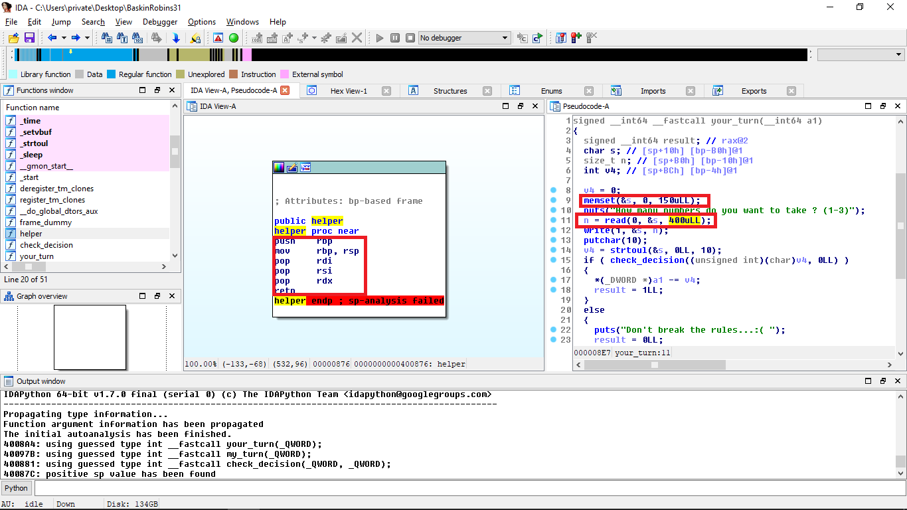

# BaskinRobins31 - 151pts (Pwn)

## 題目:

>BaskinRobins31 - 151pts (Pwn)
>
>nc ch41l3ng3s.codegate.kr 3131
>
>[Download](BaskinRobins31)


## Overview:

水題不解釋

為左令題目變簡單d，題目特登加左個helper gadget，無語-_-



無開到PIE同CANARY，好多野可以做到。


```
gdb-peda$ checksec
CANARY    : disabled
FORTIFY   : disabled
NX        : ENABLED
PIE       : disabled
RELRO     : Partial
```

## Vulnerability


右邊段 code 比你 read 400 個字，但淨系準備 150 個位，一睇就知要BufferOverFlow，而且系PIE同CANARY disable嘅狀態之下基本上可以為所欲為，不過出題者話

>hint: ROP

嘛，ROP系最簡單嘅方法，唔洗hint都知道。


## Exploit

呢題麻煩嘅地方系要 libc info 去建構 ROP。leak libc info 本身并唔難，利用 overflow call write_plt 就可以，但係 overflow leak 完 info 之後要翻去 input 度再 overflow 多次比較麻煩，呢度用左好多時間，直到我留意到helper gadget 嘅存在，所以直接用helper gadget, mission complete.

solution: [solve.py](solve.py)

```
[+] Opening connection to ch41l3ng3s.codegate.kr on port 3131: Done
system: 0x7fbd47e1b390
[*] Switching to interactive mode
$ ls
BaskinRobins31
flag
$ cat flag
flag{The Korean name of "Puss in boots" is "My mom is an alien"}
$  
```
